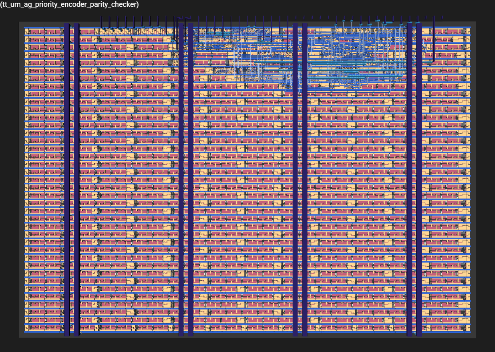

   

# Priority Encoder Parity Checker Module for Tiny Tapeout

The Priority Encoder with Parity Checker is a Verilog module written for [Tiny Tapeout SKY25a shuttle](https://app.tinytapeout.com/shuttles/ttsky25a) that does [priority encoding](https://en.wikipedia.org/wiki/Priority_encoder) of a 9-bit binary input into a 4-bit binary code. On the [Tiny Tapeout demo board](https://github.com/TinyTapeout/tt-demo-pcb) the decimal equivalent (1 to 9) of the priority code will be output on the 7-segment display. Additionally it also does parity checking and outputs the resultant parity bit.
- [Read the documentation for project](docs/info.md)

## Specifications

- Tile area: 161.0um x 111.52um
- Stdcell count: 113 (excluding FILL and TAP cells)
- Routing utilization: 6%
- Digital Vdd: 1.8V
- Max Clk freq supported by TT: 66 MHz
- No. of input pins used: 11 
  - 9-bit Binary input
  - 1-bit Priority mode select
  - 1-bit Parity mode select
- No. of output pins used: 13 
  - 8-bit output to drive 7-segment display
  - 4-bit priority code
  - 1-bit parity output
- PDK: SKY130A, 5 metal layers

## What is Tiny Tapeout?

Tiny Tapeout is an educational project that aims to make it easier and cheaper than ever to get your digital and analog designs manufactured on a real chip.

To learn more and get started, visit https://tinytapeout.com.

## Contents of Verilog project

1. Verilog files are in the `src` folder.
2. [info.yaml](info.yaml) has information about this project and lists the `source_files` and `top_module`.
3. [docs/info.md](docs/info.md) has a description of this project.
4. Testbench in `test` folder has been adapted for this design. See [test/README.md](test/README.md) for more information.

The GitHub action will automatically build the ASIC files using [OpenLane](https://www.zerotoasiccourse.com/terminology/openlane/).

## Resources

- [FAQ](https://tinytapeout.com/faq/)
- [Build your design locally](https://www.tinytapeout.com/guides/local-hardening/)
